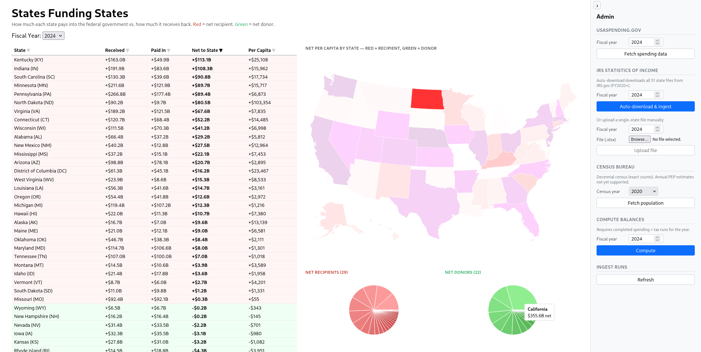

# States Funding States

> How much does each U.S. state pay into the federal government — and how much does it get back?

States Funding States pulls federal spending, IRS tax receipts, and Census population data to compute each state's net balance with the federal government, then visualises the flows in an interactive dashboard.

---

## Screenshot



---

## Features

- **Federal spending per state** — sourced from [USASpending.gov](https://usaspending.gov) by place of performance
- **IRS tax receipts per state** — sourced from IRS Statistics of Income (SOI) Data Book, broken down by tax type (individual income, corporate, payroll, excise, estate)
- **Census population** — 2020 decennial exact counts from the U.S. Census Bureau API
- **Computed balances** — net received, net paid, per-capita net for all 50 states + D.C.
- **Interactive dashboard** with:
  - Sortable data table
  - Choropleth map (hover for per-capita figures)
  - Pie charts — recipient states vs. donor states
  - Return-on-dollar bar chart ($ received per $1 paid)
  - Net by state bar chart
  - Paid vs. received per capita scatter plot

---

## Data Sources

| Source | How it's collected | Notes |
|---|---|---|
| [USASpending.gov](https://api.usaspending.gov) | API — no key required | Spending by place of performance; all categories aggregated |
| [IRS SOI Data Book](https://www.irs.gov/statistics/soi-tax-stats-irs-data-book) | Auto-downloaded per state (`{YY}db{statename}.xlsx`) | FY 2020+ supported; amounts in thousands of dollars |
| [Census Bureau](https://api.census.gov) | API — free key required | 2020 decennial PL 94-171 (`P1_001N`); annual estimates not yet supported |

---

## Tech Stack

| Layer | Technology |
|---|---|
| Monorepo | pnpm workspaces |
| API | Fastify 5, TypeScript, tsx |
| Web | React 18, Vite, Recharts, react-simple-maps |
| Database | PGlite (embedded PostgreSQL) |
| ORM | Drizzle ORM |
| Data | `@sfs/collectors`, `@sfs/processor` internal packages |

### Workspace layout

```
apps/
  api/          Fastify API server
  web/          React frontend (Vite)
packages/
  db/           PGlite client, Drizzle schema, migrations, seed data
  collectors/   USASpending, IRS SOI, Census fetchers
  processor/    Balance computation logic
```

---

## Getting Started

### Prerequisites

- Node.js 20+
- pnpm 9+
- A free [Census Bureau API key](https://api.census.gov/data/key_signup.html)

### 1. Clone and install

```bash
git clone https://github.com/your-org/StatesFundingStates.git
cd StatesFundingStates
pnpm install
```

### 2. Configure environment

```bash
cp .env.example .env
```

Edit `.env` and set your Census API key:

```env
CENSUS_API_KEY=your_key_here
```

The other variables have sensible defaults and can be left as-is for local development.

### 3. Run the API server

```bash
pnpm dev:api
```

On first start the API runs preflight checks, applies database migrations, and seeds the 51 states reference table automatically.

### 4. Run the web app

In a second terminal:

```bash
pnpm dev:web
```

Open [http://localhost:5173](http://localhost:5173).

---

## Ingesting Data

Use the **Admin** panel (right side of the dashboard) to populate data. Run these steps in order:

### 1 — IRS SOI (tax receipts)

Click **Auto-download & ingest** for your target fiscal year. The server downloads all 51 state Excel files from IRS.gov and parses them. Files are cached locally under `data/irs-soi/{year}/` so subsequent runs are instant.

> Earliest supported year: **FY 2020**

### 2 — USASpending (federal spending)

Click **Fetch spending data**. Calls the USASpending public API — no key required.

### 3 — Census (population)

Select **2020** and click **Fetch population**. Calls the Census Bureau API — key required.

### 4 — Compute balances

Once all three sources show `complete` in the **Ingest Runs** log, click **Compute** for the same fiscal year. This joins the three datasets and writes per-state balances to the database.

---

## Available Scripts

| Command | Description |
|---|---|
| `pnpm dev:api` | Start API server with hot reload |
| `pnpm dev:web` | Start Vite dev server |
| `pnpm build` | Build all packages and apps |
| `pnpm typecheck` | Run TypeScript checks across the monorepo |
| `pnpm db:generate` | Generate Drizzle migrations after schema changes |
| `pnpm db:migrate` | Apply pending migrations |

---

## Understanding the Numbers

- **Net positive (red)** — the state receives more federal dollars than it pays in taxes. These states are net beneficiaries of federal redistribution.
- **Net negative (green)** — the state pays more into the federal government than it receives back. These states are net contributors.
- **Return on dollar** — for every $1 a state sends to the federal government, how many dollars come back. Above $1.00 = net recipient; below = net donor.
- **Per capita** — net balance divided by state population (2020 census). Normalises for state size.

> All spending figures use federal fiscal year (October 1 – September 30). Tax receipts use the same fiscal year basis from IRS SOI.

---

## Caveats

- USASpending aggregates all award types as a single spending figure. A future version will split by grants, contracts, loans, direct payments, and insurance.
- IRS SOI at the state level bundles individual income tax and payroll taxes into a single line — no state-level split is published by the IRS.
- Population uses the 2020 decennial census for all fiscal years until annual estimates are added.
- Territorial spending (Puerto Rico, Guam, etc.) is excluded; only the 50 states and D.C. are included.

---

## License

MIT © Patrick Moon
